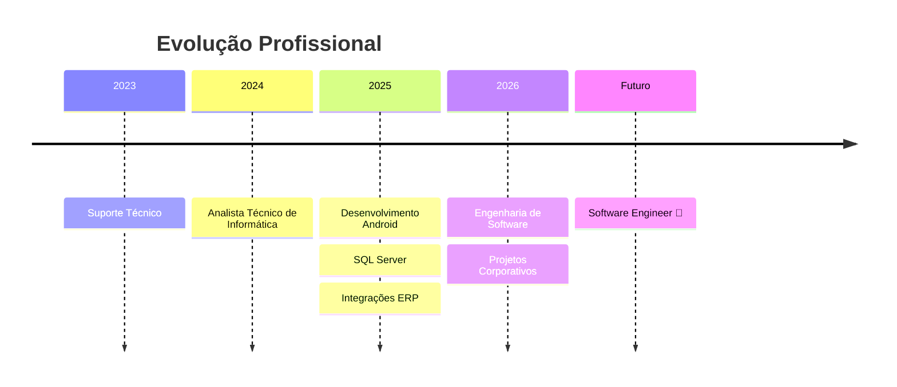

<p align="center">
  
</p>

<h1 align="center">👨‍💻 Felipe Santos</h1>

<h3 align="center">
Transformando processos empresariais em soluções digitais.
</h3>

<p align="center">

<a href="https://www.linkedin.com/in/felipe-santos-tech/">

</a>

<a href="https://felipe-santos-tech.github.io">

</a>

<a href="mailto:seuemail@email.com">

</a>

</p>

<p align="center">

</p>

---

## 🚀 Sobre mim

Sou **Analista de Sistemas** e estudante de **Engenharia de Software**, apaixonado por tecnologia e resolução de problemas reais.

Atualmente atuo no desenvolvimento e manutenção de sistemas corporativos, criando soluções que automatizam processos, reduzem retrabalho e aumentam a produtividade das equipes.

### Áreas de atuação

- 📱 Desenvolvimento Android Nativo
- 🗄️ SQL Server e modelagem de banco de dados
- ⚙️ Sistemas ERP em Delphi/Pascal
- 🔗 Integrações entre sistemas
- 🤖 Automação de processos corporativos
- 📊 Desenvolvimento de ferramentas internas
- 🚀 Engenharia de Software

---

## 🔥 Atualmente

```txt
📚 Engenharia de Software
📱 Desenvolvimento Android
🗄️ SQL Server
⚙️ ERP Delphi/Pascal
🔗 Integrações Corporativas
🚀 Construindo novos projetos
```

---

## 🛠️ Tecnologias e Ferramentas

<p align="center">


</p>

<div align="center">

| Linguagens | Mobile | Banco de Dados | Ferramentas |
|------------|---------|----------------|-------------|
| Java | Android | SQL Server | Git |
| Kotlin | Android Studio | SQLite | GitHub |
| Delphi | Mobile Native | MySQL | VS Code |
| Pascal | Java APIs | T-SQL | SSMS |

</div>

---

## 🚀 Projetos em Destaque

### 📱 Sistema de Checklist para Reforma de Betoneiras

Aplicativo Android desenvolvido para gerenciamento de inspeções técnicas de caminhões em reforma.

#### Funcionalidades

✅ Seleção de modelos de betoneiras

✅ Checklist técnico completo

✅ Registro de peças para substituição

✅ Integração com banco SQL Server

✅ Comunicação com ERP corporativo

✅ Geração de propostas comerciais

---

### ⚙️ Integrações Corporativas

Desenvolvimento de soluções internas para conectar setores e eliminar processos manuais.

#### Benefícios

✅ Redução de retrabalho

✅ Menos erros operacionais

✅ Processos mais rápidos

✅ Melhor rastreabilidade

---

### 🎁 Lista de Casamento Interativa

Site responsivo hospedado via GitHub Pages.

#### Tecnologias

✅ HTML5

✅ CSS3

✅ JavaScript

✅ GitHub Pages

---

## 💡 O que gosto de construir

```txt
📱 Aplicativos Android
🗄️ Sistemas baseados em SQL
⚙️ Integrações ERP
🤖 Automações de processos
📊 Ferramentas corporativas
🚀 Soluções para produtividade
```

---

## 📈 Estatísticas GitHub

<p align="center">


</p>

---

## 🏆 Conquistas

<p align="center">

</p>

---

## 🛤️ Minha Jornada



---

## 📚 Atualmente estudando

- Arquitetura de Software
- Desenvolvimento Android Moderno
- Banco de Dados Avançado
- APIs REST
- Design Patterns
- Clean Code
- Engenharia de Software

---

## 📫 Contato

<p align="center">

<a href="https://www.linkedin.com/in/felipe-santos-tech/">

</a>

<a href="https://felipe-santos-tech.github.io">

</a>

</p>

---

<p align="center">

💡 _"Tecnologia não é apenas código. É transformar problemas em soluções."_

</p>
